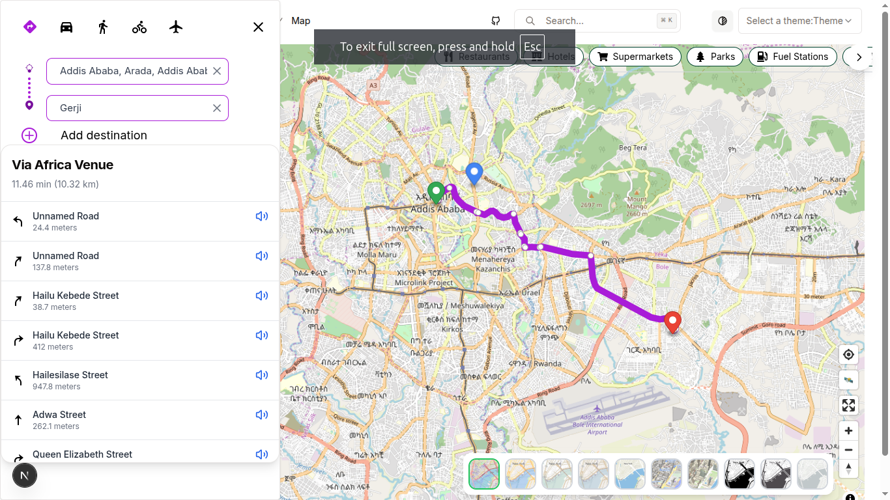
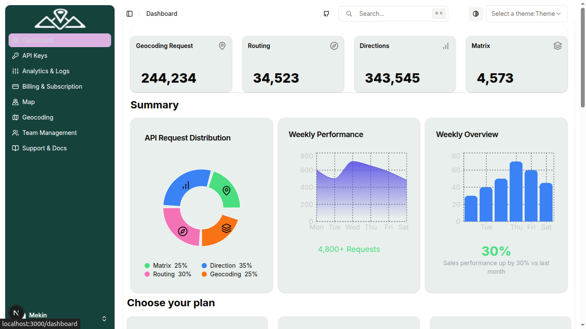

# 🗺️ Ambalay Maps v2

**Ambalay Maps v2** is a powerful, feature-rich, interactive mapping application built with **Next.js**, **TypeScript**, **MapLibre GL JS**, and **Redux Toolkit**. It supports multi-waypoint routing, POI discovery, elevation profiling, dynamic map styles, and a beautiful user experience.

> ✅ This is the updated version of the original Ambalay frontend, restructured using modern tools and best practices.

---

## ✨ Features

### 🧭 Dynamic Routing

- Draggable multi-waypoint routing
- Supports car, pedestrian, bicycle profiles
- Turn-by-turn instructions
- Elevation profiling with visual charts

### 📍 POI Discovery

- Search by categories (e.g., Restaurants, Hospitals)
- OpenStreetMap Overpass API integration
- Interactive markers with detailed popups

### 🗺️ Map Styling

- Multiple base map styles
- Light/Dark mode support
- Satellite and 3D toggle

### 👤 UX Enhancements

- User geolocation tracking
- Toast notifications
- Smooth UI animations
- Fully responsive design

---

## 🚀 Getting Started

### 1. Clone the repository

```bash
git clone https://github.com/Mekin-jema/Ambalay-Maps-v2.git
cd Ambalay-Maps-v2
```

### 2. Install dependencies

```bash
npm install
# or
yarn install
```

### 3. Add environment variables

Create a `.env.local` file in the root of the project:

```env
# Map tile and style API key from MapTiler (used by MapLibre)
VITE_MAP_API_KEY=your_maptiler_api_key

#  Different map styles' API key from Geoapify
NEXT_PUBLIC_API_KEY=your_geoapify_api_key
```

Replace with your actual API keys from [Maptiler/MapLibre](https://maptiler.com/maps/) and [Geoapify](https://www.geoapify.com/).

---

## 🧪 Running the App

```bash
npm run dev
```

Visit: [http://localhost:3000](http://localhost:3000)

---

Edit `map-styles/variable-style.ts`:

```ts
export const variableStyles = [
  {
    name: "Light",
    url: "https://tiles.stadiamaps.com/styles/alidade_smooth.json",
  },
  {
    name: "Dark",
    url: "https://tiles.stadiamaps.com/styles/alidade_dark.json",
  },
];
```

### 🏷️ POI Categories

Edit `utils/category.ts`:

## 📡 APIs Used

- **Routing**: [Valhalla](https://github.com/valhalla/valhalla), [OSRM](http://project-osrm.org/)
- **Geocoding**: [Geoapify](https://www.geoapify.com/), [Nominatim](https://nominatim.org/)
- **POIs**: [OpenStreetMap Overpass API](https://overpass-api.de/)

---

## 🧰 Tech Stack

- [Next.js](https://nextjs.org/)
- [TypeScript](https://www.typescriptlang.org/)
- [MapLibre GL JS](https://maplibre.org/)
- [Redux Toolkit](https://redux-toolkit.js.org/)
- [React Toastify](https://fkhadra.github.io/react-toastify/)
- [Recharts](https://recharts.org/)
- [Framer Motion](https://www.framer.com/motion/)
- [Lucide Icons](https://lucide.dev/)

---

## 📸 Screenshots




---
